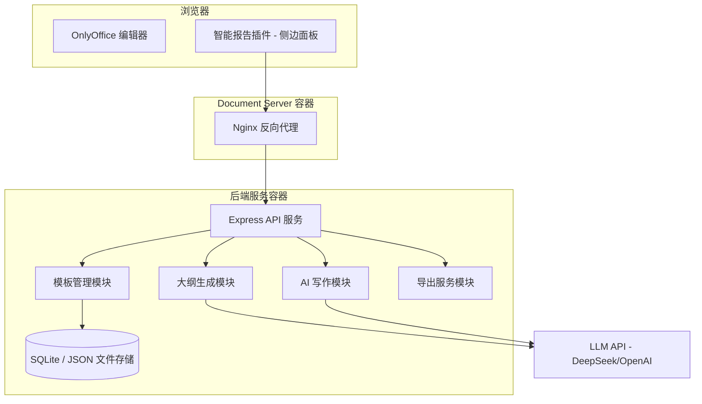

# 智能报告生成系统 - 实施规划

## 需求分析

PRD 共 9 个功能模块，按照与 OnlyOffice 插件的关联度和优先级，分为两个阶段：

**Phase 1（核心，本次规划范围）**：模块 1 大纲生成、模块 2 模板库、模块 4 内容生成（AI 写作 + 工具调用）、模块 7 导出

**Phase 2（后续）**：模块 3 协同编辑（OnlyOffice 原生支持）、模块 5 知识库、模块 6 RAG 检索、模块 8/9 访问控制与权限

---

## 架构设计

现有架构为：`OnlyOffice Plugin (侧边面板)` -> `nginx 反向代理` -> `Express 后端` -> `LLM API`

新架构在此基础上扩展：



---

## 插件 UI 重构

当前 AI Writer 插件是一个平面列表式 UI。新系统需要重构为**多 Tab 面板**，包含以下视图：

- **大纲 Tab**：项目表单输入 + AI 生成大纲 + 大纲树形编辑 + 一键插入文档
- **模板 Tab**：模板列表 + 预览 + 应用模板到文档
- **写作 Tab**：保留现有 AI 写作能力（润色/扩写/改写等）+ 新增历史片段推荐
- **导出 Tab**：预览 + 导出为 Markdown/PDF/DOCX

---

## 模块 1：报告大纲目录生成

### 1.1 表单输入

插件侧边面板提供结构化表单，字段包括：
- 项目名称（必填）
- 报告类型（下拉选择：可行性研究报告、技术方案、市场分析报告等）
- 产品描述（文本域）
- 目标市场（文本域）
- 核心技术（文本域）
- 预估投资（输入框）
- 团队配置（文本域）

### 1.2 AI 自动生成大纲

后端新增 `POST /api/outline/generate` 接口：
- 接收表单数据 + 报告类型
- 调用 LLM 生成结构化大纲（JSON 格式，含多级标题和描述）
- 返回大纲 JSON

### 1.3 大纲编辑与插入文档

插件端：
- 大纲以树形结构展示，支持拖拽排序、增删改节点
- 点击"应用到文档"按钮，通过 `callCommand` 调用 Office JS API：
  - 清空或在光标处插入
  - 按层级插入 Heading 1/2/3 段落
  - 最后调用 `AddTableOfContents()` 自动生成目录

关键代码模式（在 `callCommand` 内）：

```javascript
Asc.plugin.callCommand(function() {
  var doc = Api.GetDocument();
  // 逐个创建 Heading 段落
  var para = Api.CreateParagraph();
  para.AddText("1. 执行摘要");
  para.SetStyle(doc.GetStyle("Heading 1"));
  doc.InsertContent([para], true);
  // ... 更多章节
  // 最后插入目录
  doc.AddTableOfContents({
    ShowPageNums: true, RightAlgn: true,
    LeaderType: "dot", FormatAsLinks: true,
    BuildFrom: { OutlineLvls: 3 }, TocStyle: "standard"
  });
}, true, true);
```

### 1.4 文件导入

支持用户上传 Word/Excel 文件，后端解析提取结构信息。
- 后端新增 `POST /api/outline/import` 接口
- 使用 `mammoth`（Word 解析）或 `xlsx`（Excel 解析）npm 包
- 提取标题层级，返回大纲 JSON

---

## 模块 2：报告大纲模板库

### 2.1 内置模板

后端维护模板数据（初期用 JSON 文件存储在 `backend/data/templates/` 目录）：

```
backend/data/templates/
  feasibility-study.json      # 可行性研究报告
  technical-proposal.json     # 技术方案
  market-analysis.json        # 市场分析报告
  ...
```

每个模板的数据结构：

```json
{
  "id": "feasibility-study",
  "name": "可行性研究报告",
  "description": "标准可行性研究报告结构",
  "sections": [
    { "title": "执行摘要", "level": 1, "description": "项目概述和关键结论" },
    { "title": "项目背景", "level": 1, "children": [
      { "title": "行业现状", "level": 2, "description": "..." },
      { "title": "项目由来", "level": 2, "description": "..." }
    ]},
    ...
  ]
}
```

### 2.2 API 接口

- `GET /api/templates` - 获取模板列表
- `GET /api/templates/:id` - 获取模板详情
- `POST /api/templates` - 创建自定义模板
- `PUT /api/templates/:id` - 更新模板
- `DELETE /api/templates/:id` - 删除模板
- `POST /api/templates/import` - 导入模板文件
- `GET /api/templates/:id/export` - 导出模板文件

### 2.3 插件端交互

模板 Tab 展示模板卡片列表，点击可预览大纲结构，点击"使用此模板"将大纲填充到大纲编辑器中，再由用户调整后插入文档。

---

## 模块 4：报告内容生成

### 4.1 AI 辅助写作（增强现有能力）

保留现有 6 种操作（扩写/改写/润色/翻译/总结/续写），新增：

- **智能校稿** `POST /api/proofread`：语法、拼写、格式检查，返回带修改建议的结构化结果
- **章节生成** `POST /api/generate-section`：根据大纲章节标题 + 上下文，AI 生成该章节内容
- **全文生成** `POST /api/generate-report`：基于完整大纲，逐章节流式生成报告内容

章节生成的关键设计：
- 接收参数：章节标题、章节描述、上级章节标题、项目基本信息
- LLM 按照公文写作规范生成内容
- 插件通过 `callCommand` 在对应 Heading 下方插入生成的内容

### 4.2 工具调用

利用现有的 `PasteHtml` 能力，扩展工具调用：
- **表格生成**：`POST /api/tools/table` - AI 根据描述生成 HTML 表格，插入文档
- **公式插入**：通过 `PasteHtml` 插入 LaTeX 公式的图片渲染
- **流程图/结构图**：AI 生成 Mermaid 代码 -> 后端渲染为 SVG/PNG -> 以图片形式插入文档

后端新增：
- `POST /api/tools/table` - AI 生成表格
- `POST /api/tools/chart` - 生成图表（使用 chart.js + canvas 渲染为图片）
- `POST /api/tools/diagram` - Mermaid 图表渲染

---

## 模块 7：报告导出

OnlyOffice 插件 API 原生支持文档导出：

```javascript
// 导出为 PDF
Asc.plugin.executeMethod("GetFileToDownload", ["pdf"], function(url) {
  window.open(url);
});

// 导出为 Markdown
Asc.plugin.executeMethod("ConvertDocument", 
  ["markdown", false, false, true, false], 
  function(markdownContent) { /* 下载 */ }
);
```

插件端"导出 Tab"提供：
- 格式选择：DOCX（原生保存）、PDF、Markdown
- 导出按钮，调用对应的 `executeMethod`
- Markdown 导出后可在面板内预览

---

## 文件变更清单

### 新增文件

| 文件 | 用途 |
|------|------|

**插件侧**（`plugins/ai-writer/` 下，或考虑新建 `plugins/report-generator/`）：
- `index.html` - 重写，多 Tab 布局
- `scripts/code.js` - 重写，模块化拆分
- `scripts/outline.js` - 大纲生成与管理逻辑
- `scripts/template.js` - 模板库交互逻辑
- `scripts/writer.js` - AI 写作逻辑（迁移现有代码）
- `scripts/export.js` - 导出功能逻辑
- `scripts/utils.js` - 公共工具函数（executeMethod Promise 封装等）
- `styles/style.css` - 重写，适配多 Tab 布局
- `config.json` - 新插件配置（新 GUID）

**后端侧**（[backend/](backend/) 下）：
- `routes/outline.js` - 大纲相关路由
- `routes/templates.js` - 模板相关路由
- `routes/writer.js` - AI 写作路由（迁移现有代码）
- `routes/tools.js` - 工具调用路由
- `routes/export.js` - 导出辅助路由
- `services/llm.js` - LLM 调用服务（从 server.js 中抽取）
- `services/template-store.js` - 模板存储服务
- `data/templates/*.json` - 内置模板文件

### 修改文件

- [docker-compose.yml](docker-compose.yml) - 新增插件 volume 挂载、可能新增服务
- [backend/server.js](backend/server.js) - 重构为路由分离模式
- [backend/package.json](backend/package.json) - 新增依赖（mammoth, xlsx 等）
- [documentserver/ds-backend-proxy.conf](documentserver/ds-backend-proxy.conf) - 新增代理路径（如需要）
- [dev.sh](dev.sh) - 适配新插件目录

---

## 实施步骤（建议顺序）

1. **后端重构**：将现有 server.js 拆分为路由模块结构，抽取 LLM 服务层
2. **新建插件骨架**：创建 `plugins/report-generator/` 目录，搭建多 Tab UI 框架，迁移现有 AI 写作能力
3. **模板库实现**：后端模板 CRUD API + 内置 3-5 个标准模板 + 插件端模板浏览和选择
4. **大纲生成实现**：后端大纲 AI 生成 API + 插件端表单和大纲树形编辑器 + callCommand 插入文档
5. **章节内容生成**：后端章节生成 API + 插件端逐章节生成交互
6. **工具调用实现**：表格生成、图表渲染等后端 API + 插件端工具面板
7. **导出功能**：插件端调用 OnlyOffice 原生导出 API，支持 PDF/DOCX/Markdown
8. **智能校稿**：后端校稿 API + 插件端校稿结果展示和一键修正
